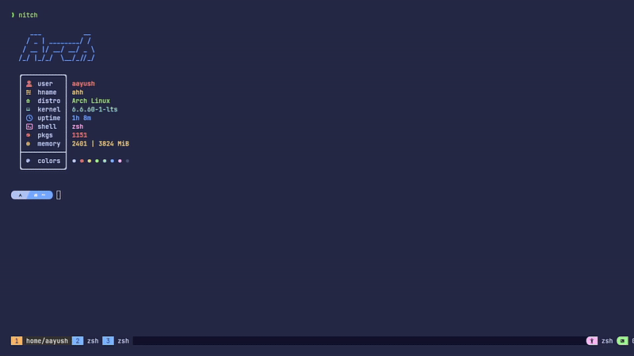

<h3 align="center">
<strong>Carch</strong>
</h3>

~ Carch allows you to customize your Arch  System, adding configurations and installing packages for a ready-to-use Linux environment.

 

 
[![Code of Conduct][coc-badge]][coc] [![PRs Welcome][prs-badge]][prs] 

 

[Installation](/.github/INSTALLATION.md) •
[Contributing](/.github/CONTRIBUTING.md) •
[Roadmap ↗](./github/ROADMAP.md) 

 

  

[![Downloads][downloads-badge]][downloads-link]

## Preview

  
Terminal Preview 

> [!Note]
> This project is still in development, and you may encounter some bugs. 
> Please feel free to submit an issue if you run into any problems:
> [Submit an Issue](https://github.com/harilvfs/carch/issues).

## Contact
 

For questions or suggestions, feel free to reach out via:

- 📧 Email: **harilvfs@chalisehari.com.np**

___

 

 <a href="https://github.com/harilvfs">
       <picture>
           <source height="24px" media="(prefers-color-scheme: dark)" srcset="https://i.ibb.co/dMMmCrW/Git-Hub-Mark.png" />
           
       </picture>
   </a>&nbsp;&nbsp;&nbsp;
   <a href="https://discord.com/invite/8NJWstnUHd">
       <picture>
           <source height="24px" media="(prefers-color-scheme: dark)" srcset="https://user-images.githubusercontent.com/13122796/178032563-d4e084b7-244e-4358-af50-26bde6dd4996.png" />
           
       </picture>
   </a>&nbsp;&nbsp;&nbsp;
   <a href="https://reddit.com/u/aayush-le">
       <picture>
           <source height="24px" media="(prefers-color-scheme: dark)" srcset="https://user-images.githubusercontent.com/13122796/178032351-9d9d5619-8ef7-470a-9eec-2744ece54553.png" />
           
       </picture>
   </a>&nbsp;&nbsp;&nbsp;
   <a href="https://behance.com/aayushchalese">
      <picture>
         <source height="25px" media="(prefers-color-scheme: dark)" srcset="https://raw.githubusercontent.com/harilvfs/assets/refs/heads/main/harilvfs/behancex.svg" />
         
     </picture>
   </a>&nbsp;&nbsp;&nbsp;
   <a href="https://t.me/harilvfs">
      <picture>
         <source height="24px" media="(prefers-color-scheme: dark)" srcset="https://user-images.githubusercontent.com/13122796/178032213-faf25ab8-0bc3-4a94-a730-b524c96df124.png" />
         
      </picture>
   </a>&nbsp;&nbsp;&nbsp;
   <a href="https://medium.com/@aayushchalise">
      <picture>
         <source height="25px" media="(prefers-color-scheme: dark)" srcset="https://github.com/harilvfs/assets/blob/main/harilvfs/medium.png" />
         
     </picture>
   </a>&nbsp;&nbsp;&nbsp;
   <a href="https://x.com/harilvfs">
      <picture>
         <source media="(prefers-color-scheme: dark)" srcset="https://user-images.githubusercontent.com/93124920/270180600-7c1b38bf-889b-4d68-bd5e-b9d86f91421a.png">
         
      </picture>
   </a>&nbsp;&nbsp;&nbsp;
   <a href="https://www.youtube.com/@aayushchalese">
      <picture>
         <source height="24px" media="(prefers-color-scheme: dark)" srcset="https://user-images.githubusercontent.com/13122796/178032714-c51c7492-0666-44ac-99c2-f003a695ab50.png" />
         
     </picture>
   </a>&nbsp;&nbsp;&nbsp;
   <a href="https://bsky.app/profile/chalisehari.com.np">
      <picture>
         <source height="25px" media="(prefers-color-scheme: dark)" srcset="https://raw.githubusercontent.com/harilvfs/assets/refs/heads/main/bluesky/Bluesky_app_icon.svg" />
         
     </picture>
   </a>

[downloads-badge]: https://img.shields.io/github/downloads/harilvfs/carch/total?style=for-the-badge&label=%5BCarch%5D%20Downloads&color=brightgreen&logo=github&logoColor=000000
[downloads-link]: https://github.com/harilvfs/carch/releases
[coc]:https://github.com/harilvfs/carch/blob/main/.github/CONTRIBUTING.md "Contributor Covenant Code of Conduct"
[prs]:http://makeapullrequest.com "Make a Pull Request (external link) ➶"
[prs-badge]: https://img.shields.io/badge/PRs-welcome-brightgreen.svg?style=for-the-badge&logo=data%3Aimage%2Fsvg%2Bxml%3Bbase64%2CPD94bWwgdmVyc2lvbj0iMS4wIiBlbmNvZGluZz0iVVRGLTgiPz48c3ZnIGlkPSJzdmcyIiB3aWR0aD0iNjQ1IiBoZWlnaHQ9IjU4NSIgdmVyc2lvbj0iMS4wIiB4bWxucz0iaHR0cDovL3d3dy53My5vcmcvMjAwMC9zdmciPiA8ZyBpZD0ibGF5ZXIxIj4gIDxwYXRoIGlkPSJwYXRoMjQxNyIgZD0ibTI5Ny4zIDU1MC44N2MtMTMuNzc1LTE1LjQzNi00OC4xNzEtNDUuNTMtNzYuNDM1LTY2Ljg3NC04My43NDQtNjMuMjQyLTk1LjE0Mi03Mi4zOTQtMTI5LjE0LTEwMy43LTYyLjY4NS01Ny43Mi04OS4zMDYtMTE1LjcxLTg5LjIxNC0xOTQuMzQgMC4wNDQ1MTItMzguMzg0IDIuNjYwOC01My4xNzIgMTMuNDEtNzUuNzk3IDE4LjIzNy0zOC4zODYgNDUuMS02Ni45MDkgNzkuNDQ1LTg0LjM1NSAyNC4zMjUtMTIuMzU2IDM2LjMyMy0xNy44NDUgNzYuOTQ0LTE4LjA3IDQyLjQ5My0wLjIzNDgzIDUxLjQzOSA0LjcxOTcgNzYuNDM1IDE4LjQ1MiAzMC40MjUgMTYuNzE0IDYxLjc0IDUyLjQzNiA2OC4yMTMgNzcuODExbDMuOTk4MSAxNS42NzIgOS44NTk2LTIxLjU4NWM1NS43MTYtMTIxLjk3IDIzMy42LTEyMC4xNSAyOTUuNSAzLjAzMTYgMTkuNjM4IDM5LjA3NiAyMS43OTQgMTIyLjUxIDQuMzgwMSAxNjkuNTEtMjIuNzE1IDYxLjMwOS02NS4zOCAxMDguMDUtMTY0LjAxIDE3OS42OC02NC42ODEgNDYuOTc0LTEzNy44OCAxMTguMDUtMTQyLjk4IDEyOC4wMy01LjkxNTUgMTEuNTg4LTAuMjgyMTYgMS44MTU5LTI2LjQwOC0yNy40NjF6IiBmaWxsPSIjZGQ1MDRmIi8%2BIDwvZz48L3N2Zz4%3D
[coc-badge]: https://img.shields.io/badge/code%20of-conduct-ff69b4.svg?style=for-the-badge

